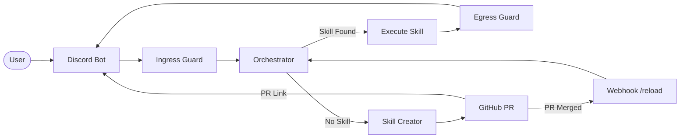

# Advisor-OS

A self-evolving AI advisor that leverages **GitHub** as its versioned memory,
**Bun** as its high-performance runtime, and **Discord** as its interface.
Skills are authored as Markdown files with YAML frontmatter and managed through
a Git-native workflow.

---

## Architecture



### Pipeline

| Step | Component | Responsibility |
|------|-----------|----------------|
| 1 | **Discord Bot** | Receives user messages, extracts channel context |
| 2 | **Ingress Guard** | Blocks prompt injection attempts |
| 3 | **Orchestrator** | Matches skills by channel group and trigger keywords |
| 4a | **Skill Execution** | Calls OpenRouter with skill body as system prompt |
| 4b | **Skill Creator** | Generates a new `.md` skill file and opens a GitHub PR |
| 5 | **Egress Guard** | Scans LLM output for unsafe content before reply |
| 6 | **Self-Healing** | Retries failed skills up to 3 times, opens fix PRs |

---

## Project Structure

```
/advisor-os
  /app                  Next.js WebUI stub
  /skills               Flat directory for .md skill files
  /src
    index.ts            Entry point (Discord Bot + Bun.serve)
    orchestrator.ts     Core brain (skill discovery, OpenRouter, healing)
    guards.ts           Ingress echo check + egress content scan
    github.ts           Octokit wrapper (branches, commits, PRs)
    loader.ts           Markdown/YAML parser for skill triggers
  Dockerfile            Multi-stage build for oven/bun:1
  docker-compose.yml    advisor + ngrok sidecar
  .env.example          Template for required environment variables
```

---

## Local Setup

### 1. Prerequisites

- [Bun](https://bun.sh/) v1.0+
- [Docker](https://docs.docker.com/get-docker/) and Docker Compose
- A Discord bot token with **Message Content Intent** enabled
- An [OpenRouter](https://openrouter.ai/) API key
- A GitHub Personal Access Token with `repo` scope
- An [ngrok](https://ngrok.com/) auth token

### 2. Configure Environment

```bash
cp .env.example .env
```

Edit `.env` and fill in every value:

| Variable | Description |
|----------|-------------|
| `OPENROUTER_API_KEY` | API key from OpenRouter |
| `DISCORD_TOKEN` | Bot token from Discord Developer Portal |
| `DISCORD_APPLICATION_ID` | Application ID from Discord Developer Portal |
| `GITHUB_PAT` | Personal Access Token with `repo` scope |
| `GITHUB_OWNER` | GitHub username or organization |
| `GITHUB_REPO` | Target repository name |
| `NGROK_AUTHTOKEN` | Auth token from ngrok dashboard |

### 3. Install Dependencies

```bash
bun install
```

### 4. Run Locally (Development)

```bash
bun run dev
```

This starts the Discord bot and the HTTP server on port `3000`.

### 5. Run with Docker

```bash
docker compose up --build
```

This starts two services:

- **advisor** -- The bot and HTTP server (port `3000`)
- **ngrok** -- Tunnels external webhook traffic to the advisor (inspect at `http://localhost:4040`)

### 6. Configure GitHub Webhook

1. In your GitHub repository, go to **Settings > Webhooks > Add webhook**.
2. Set the **Payload URL** to your ngrok public URL + `/webhook/github`.
3. Set **Content type** to `application/json`.
4. Select the **Pull requests** event.
5. Save.

When a PR is merged, the advisor will automatically reload its skills from disk.

---

## Skill Authoring

Skills are Markdown files in the `/skills` directory. Each file has YAML
frontmatter that defines metadata and a body that serves as the system prompt.

### Example Skill

```markdown
---
name: code-review
description: Performs a code review on the provided snippet
group: tech
triggers:
  - review this code
  - code review
  - check my code
---

You are a senior software engineer performing a code review...
```

### Frontmatter Fields

| Field | Type | Required | Description |
|-------|------|----------|-------------|
| `name` | string | Yes | Unique kebab-case identifier |
| `description` | string | No | One-line summary |
| `group` | string | Yes | Discord channel name this skill is scoped to |
| `triggers` | string[] | Yes | Keywords that activate this skill |

### Contextual Scoping

- A skill with `group: tech` only executes in the `#tech` channel.
- A skill with `group: system` executes in any channel.
- If a trigger matches but the channel does not, the user is redirected.

---

## Security

### Ingress Guard

Blocks messages containing known prompt injection patterns before they reach
the LLM. Examples of blocked patterns:

- "ignore previous instructions"
- "disregard all rules"
- "you are now a ..."
- "jailbreak"

### Egress Guard

Scans LLM output before delivery. Blocked patterns include:

- References to `process.env` or `.env` files
- Destructive shell commands (`rm -rf /`)
- Unauthorized network calls (`fetch()`, `axios`, `http.request`)
- Shell execution (`exec()`, `spawn()`, `child_process`)

---

## Self-Healing

When a skill fails at runtime:

1. The error is captured and logged.
2. A fix is auto-generated via OpenRouter and committed to a `fix/` branch.
3. A Pull Request is opened with the error report.
4. If the skill fails **3 consecutive times**, automatic healing stops and
   human intervention is requested.

---

## CI/CD -- Auto-Deploy on PR Merge

A GitHub Actions workflow (`.github/workflows/deploy.yml`) automatically
redeploys the application whenever a Pull Request is merged to `main`.

It runs on a **self-hosted runner** on the same machine as Docker Compose.

### Setup the Self-Hosted Runner

```bash
mkdir actions-runner && cd actions-runner

curl -o actions-runner-osx-x64-2.331.0.tar.gz -L \
  https://github.com/actions/runner/releases/download/v2.331.0/actions-runner-osx-x64-2.331.0.tar.gz

tar xzf ./actions-runner-osx-x64-2.331.0.tar.gz

./config.sh --url https://github.com/<owner>/<repo> --token <RUNNER_TOKEN>
```

Replace `<owner>/<repo>` with the repository path and `<RUNNER_TOKEN>` with the
token generated from **Settings > Actions > Runners > New self-hosted runner**.

Start the runner:

```bash
./run.sh
```

### Configuration

The deploy script requires the `ADVISOR_OS_DIR` environment variable, which
points to the live project directory where `.env` and Docker Compose reside.
This is set in the workflow file (`.github/workflows/deploy.yml`) and never
hardcoded in the script itself.

### Deploy Behavior

Once the runner is online, every merged PR will automatically:
- Pull the latest code from `main`
- Rebuild and restart the Docker Compose stack
- Prune dangling images

### Files

| File | Purpose |
|------|---------|
| `.github/workflows/deploy.yml` | Triggers on PR merge to main |
| `deploy.sh` | Pulls latest code and runs `docker compose up --build -d` |

---

## License

This project is licensed under the [MIT License](LICENSE).
